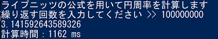
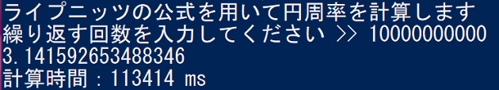

# Leibniz_pi_Java
phpとRustでライプニッツを計算していた人がいたので、Javaで書いてみた。 
 
やってた人 >> https://github.com/aida0710/leibniz-pi-rust 
 
## 実行時間

|       | 1億     | 100億     |
|-------|---------|-----------|
| Java  | 1.162s  | 113.414s  |

 
上記は，1億と100億でライプニッツを計算した際の実行時間を表にまとめたものである． 
ここでの実行時間には，クラスの計算メソッド呼び出し時間も含まれている． 
 
実行結果より，計算オーダーはおおよそ正しいといえる． 
また，先人の結果と比較すると，phpとRustの見事に中間あたりであることがわかる． 
インタプリタや最適化など，Rustの環境について調査を行う必要がありそう? 
 

## 計算結果

 また，以下は1億と100億での算出値(計算結果)である． 
 

 
計算結果を見ると，1億の際には 
<b>有効数字9桁以降間違い  : 3.1415926~43589326~</b> 
100億の際には 
<b>有効数字11桁以降間違い : 3.141592653~488346~</b> 
となっている． 
これは，phpやRustの際と変化がない． 
情報落ち等で途中から小数点以下が削り取られていっている可能性も考えられる． 

## 参考

・ライプニッツの公式で円周率πを計算 
https://talavax.com/math-leibnizformula.html#gsc.tab=0 
 
・【Javaプログラミング】nextInt()メソッドの簡単な使用例 
https://miki-prosho.com/?p=1154 
 
