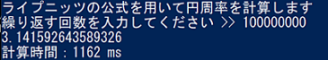

# Leibniz_pi_Java
phpとRustでライプニッツを計算していた人がいたので、Javaで書いてみた。 
 
やってた人 >> https://github.com/aida0710/leibniz-pi-rust 
 
## 実行時間

|       | 1億     | 100億     |
|-------|---------|-----------|
| Java  | 1.162s  | 113.414s  |

 
上記は，1億と100億でライプニッツを計算した際の実行時間を表にまとめたものである． 
 
実行結果より，計算オーダーはおおよそ正しい． 
また，以下は1億と100億での算出値(計算結果)である． 

 
有効数字11桁以降間違い : 3.1415926534883
